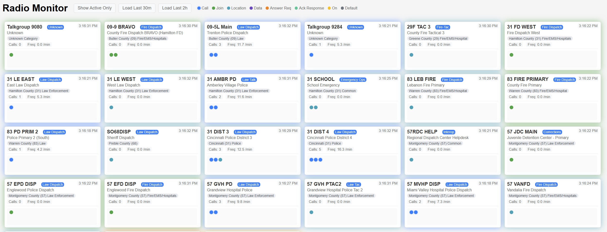
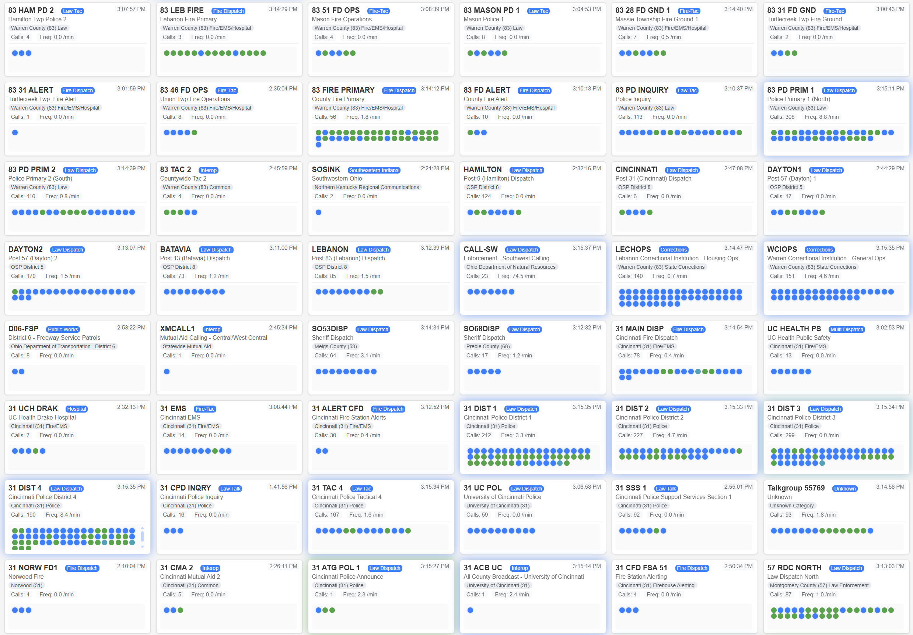

# Trunk Recorder Dashboard

> **⚠️ Disclaimer**: This is a proof of concept project and is not intended for production use. The current implementation may have limitations in scalability, reliability, and usability. Use at your own risk and expect potential issues with performance, error handling, and data consistency.

## Overview
A real-time radio monitoring dashboard that visualizes radio activity across different talkgroups. The application connects to a trunk_recorder MongoDB database to track radio events and displays them with contextual information from a RadioReference.com talkgroup metadata file. Features color-coded event tracking, activity statistics, visual feedback for recent events, filtering capabilities, and multiple sorting options.

## Screenshots

### Initial Dashboard

The dashboard starts with a clean slate and then populates seen talkgroups with metadata from an available radioreference.com csv file, organized with:
- Category and operational badges
- Talkgroup descriptions and metadata
- Ready to track radio activity
- Quick county filtering buttons for easy navigation

### Active Dashboard

As radio activity occurs, the dashboard updates in real-time showing:
- Color-coded event types for different activities
- Active radio indicators with timing information
- Call frequency statistics and event counts
- Visual feedback for recent events

The dashboard maintains a history of recent events, showing:
- Call frequency statistics
- Total event counts
- Last activity timestamps
- Active radio tracking

[Previous content remains the same until Features section]

## Features

### Real-time Event Monitoring
[Content remains the same]

### Visual Feedback
[Content remains the same]

### Statistics & Metrics
[Content remains the same]

### Filtering, Sorting & Organization
- County-based filtering with quick selection buttons:
  - All (shows all counties)
  - Hamilton County (hamco)
  - Warren County (warco)
  - Butler County (butco)
  - Montgomery County (monco)
- Toggle between all talkgroups and active-only view
- Active filter shows only talkgroups with call history
- Multiple sorting options:
  - ID (default): Sort by talkgroup number
  - Calls: Sort by total number of calls
  - Frequency: Sort by calls per minute
  - Recent: Sort by most recent activity
- Compact, information-dense card layout
- Grouped radio indicators per talkgroup

[Rest of the content remains the same]
